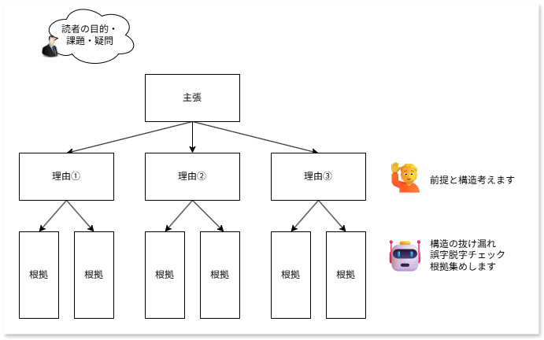

# ワークスロップを避けるためのAI活用戦略

## ビジネスの影響
- AIを利用して文章作成を効率化できる一方で、信頼のおける文章を作成するにはレビューが必要である。
- 個人の効率をいかに上げても、品質向上の効率が上がらなければビジネス全体の効率は上がらない。
- ソースコードの場合は信頼のおけるテストケースが必要ではあるが、文章の場合信頼のおける編集長的な視点が必要であるため、一概にプログラムのように自動化できるとはいいがたい。

## AI活用戦略
- チームで行う場合、レビュワーがボトルネックとなる。
- レビュワーの付加を下げるために、個人の品質向上のためのAI活用が重要である。
- 以下に文章作成時のAI活用戦略のコツを示す。
  - 文章には必ず読者がいて、読者は何かしらの目的や課題を持っている。これは人間が問いを立てる。なぜなら、そういった背景はおよそハイコンテキストであり、十人十色であり、正解はAIの中にはないから。
  - 読者の目的や課題を満たすための主張とその理由の構造も人間が問いを立てる。ここをAIに考えさせても、いい意味でも悪い意味でも平均点の物しか出ない。
  - 根拠の抜け漏れチェック、Web検索で分かる情報収集、文章の誤字脱字チェックなどはAIに任せる。

## 概念図

## トレードオフ
- AI文章でも受け入れられるの、読者は自分とかであれば不要。

## 参考情報
- [生成AI頼みでワークスロップを起こさない ドキュメントライティング＆レビュー術](https://speakerdeck.com/naohiro_nakata/sheng-cheng-ailai-midewakusurotupuwoqi-kosanai-dokiyumentoraiteingu-and-rebiyushu)