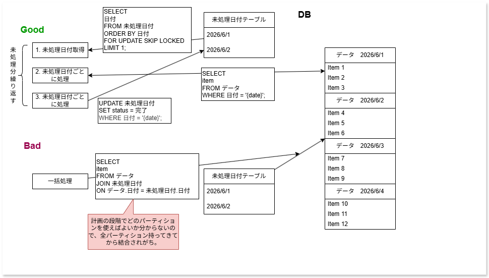

# パーティションを効率的に活用するためには

## ビジネスの影響
- バッチ処理時間やユーザーからの応答時間を短縮できる。
- バッチウィンドウ内での安定したシステム稼働による保守費用逓減であったり、ユーザー満足度向上などのビジネス上のメリットがある。

## パーティションの活用方法
- WHERE句にパーティションキーを含めることで、パーティションプルーニングが効く。
  - 逆に言えば、パーティションキーでJOINする場合（wise-partitioned joinなど考慮している場合は別だが、）基本的には他パーティションもすべて持ってくることになるため、IOが増えたりする。
  - WHERE EXISTS句でサブクエリにパーティションキー含んでいた場合、Nested Loop Joinのような形であれば、実行時にパーティションプルーニング効くこともある。
- WHERE句にパーティションキーを含める場合、往々にしてアプリ側でパーティションキーの特定と組み込みと実行制御が必要になる。

## 概念図

## トレードオフ
- アプリケーションにデータを持ってこないといけない。
  - 管理系であれば大したことないと思う。

## 参考情報
-[ 第2回「PostgreSQL11でのテーブル・パーティショニング機能の改善」](https://www.intellilink.co.jp/column/oss/2019/010900.aspx)
-[PostgreSQLのパーティションで全パーティションスキャンされるケースを確認してみる](https://blog.k-bushi.com/post/tech/database/postgresql-partition-full-scan-cases/)